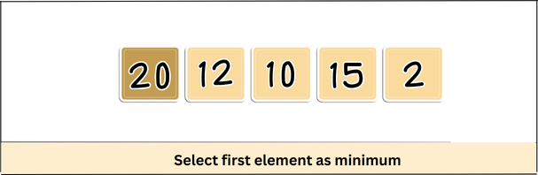
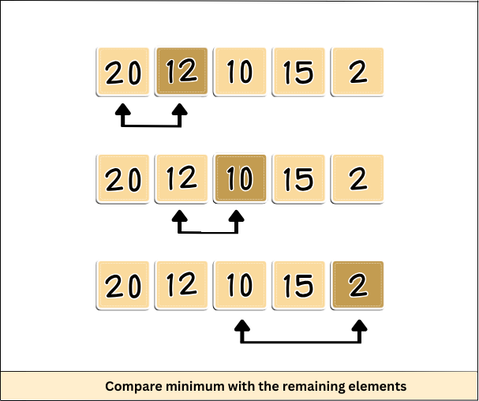
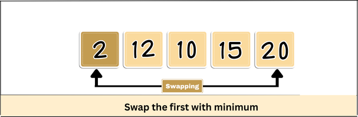
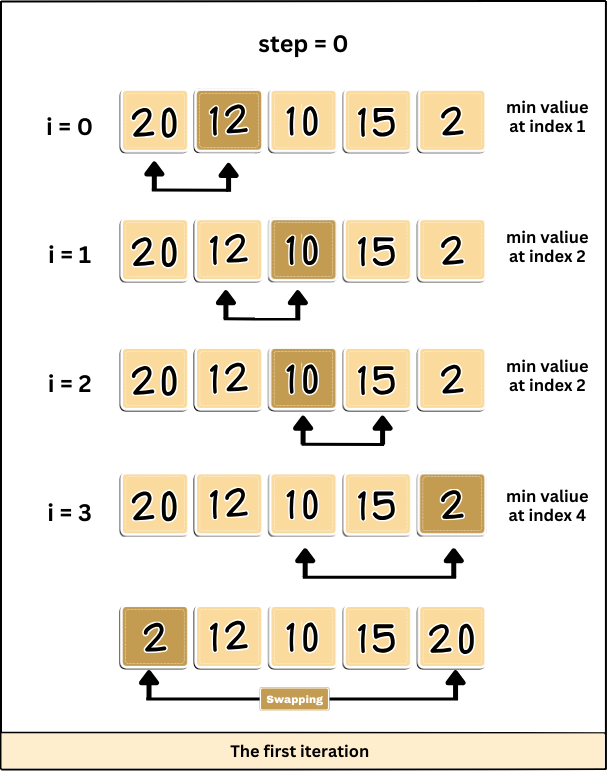
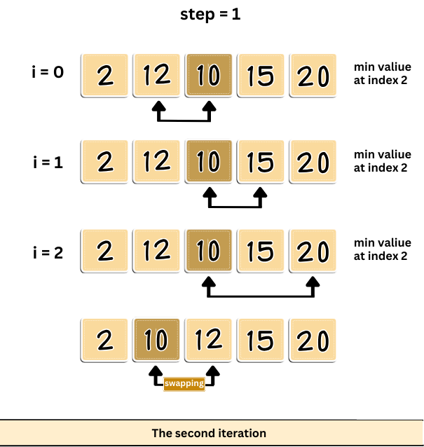
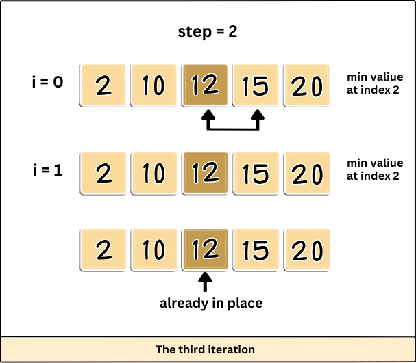
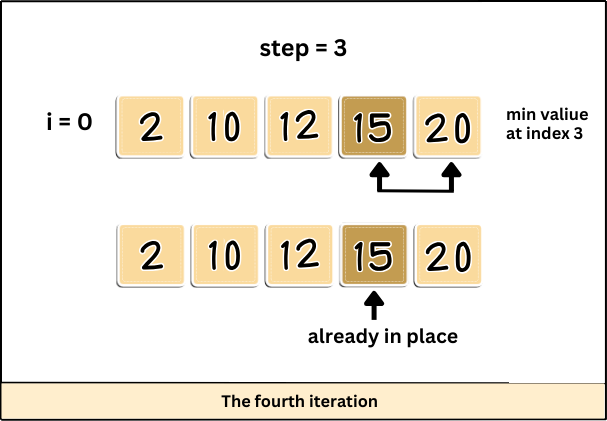

# Selection Sort Algorithm

Selection sort is a sorting algorithm that selects the smallest element from an unsorted list in each iteration and places that element at the beginning of the unsorted list. It is an in-place comparison-based algorithm.

---

## Steps:

### 1. Set the first element as **minimum**


### 2. Compare **minimum** with the second element:
- If the second element is smaller than **minimum**, assign the second element as minimum.
- Compare **minimum** with the third element. Again, if the third element is smaller, then assign **minimum**.



### 3. After each iteration, **minimum** is placed in the front of the unsorted list.


### 4. Repeat the process:
For each iteration, indexing starts from the first unsorted element. Steps 1 to 3 are repeated until all the elements are placed at their correct positions.






---

## Selection Sort Algorithm Code

```java
public class SelectionSort {
    public static void selectionSort(int[] arr) {
        for (int step = 0; step < arr.length - 1; step++) {
            int minIndex = step;
            for (int j = step + 1; j < arr.length; j++) {
                if (arr[j] < arr[minIndex]) {
                    minIndex = j;
                }
            }
            // Swap the found minimum element with the current element
            int temp = arr[minIndex];
            arr[minIndex] = arr[step];
            arr[step] = temp;
        }
    }

    public static void main(String[] args) {
        int[] array = {64, 25, 12, 22, 11};
        System.out.println("Original array:");
        for (int num : array) {
            System.out.print(num + " ");
        }

        selectionSort(array);

        System.out.println("\n\nSorted array:");
        for (int num : array) {
            System.out.print(num + " ");
        }
    }
}
```


<div style="text-align: center; font-size: 12px; color: #6c757d; background-color: white; padding: 10px; border-radius: 5px;">
  &copy; 2025 Selection Sort Tutorial  
  <br />
  <a href="https://github.com/Saifmalik2004" style="margin-right: 10px;">
    
  </a>
  <a href="https://www.linkedin.com/in/saif-malik-901635307">
    
  </a>
</div>


